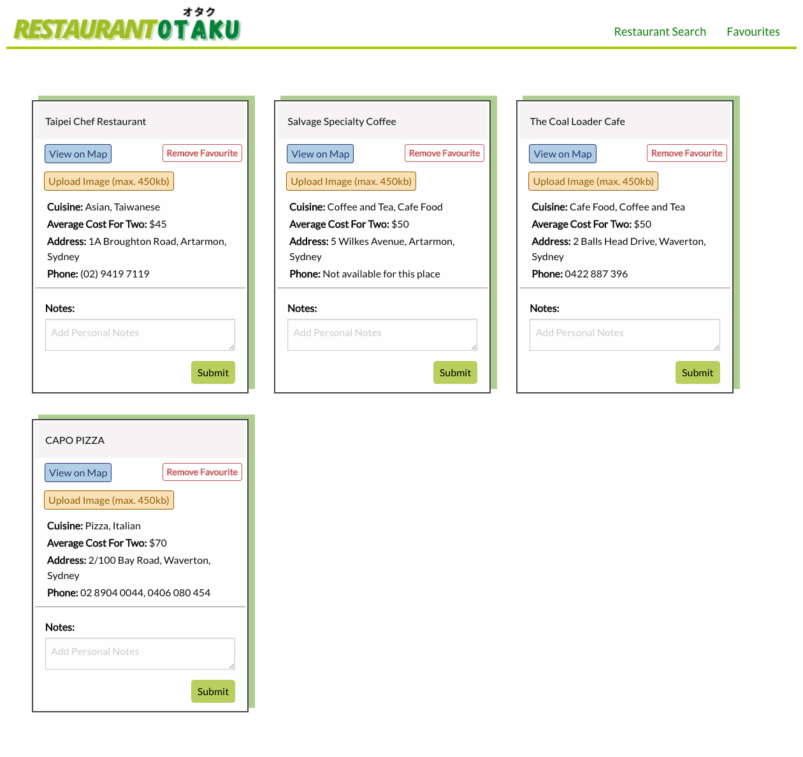
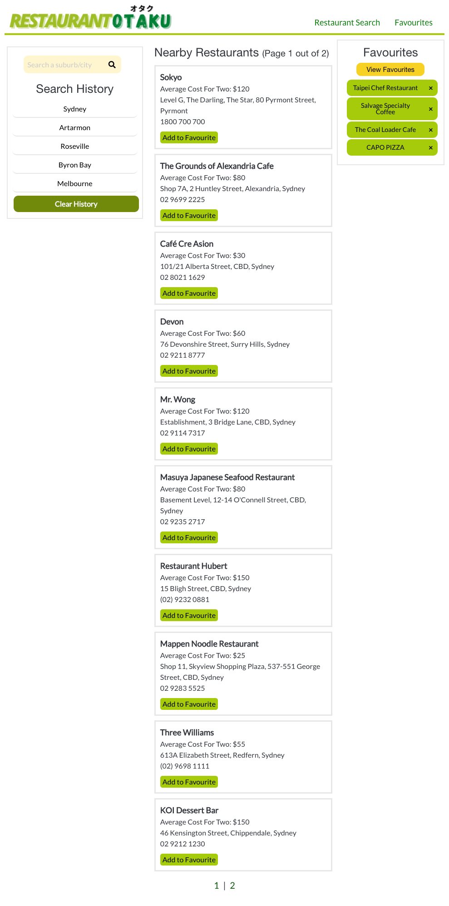
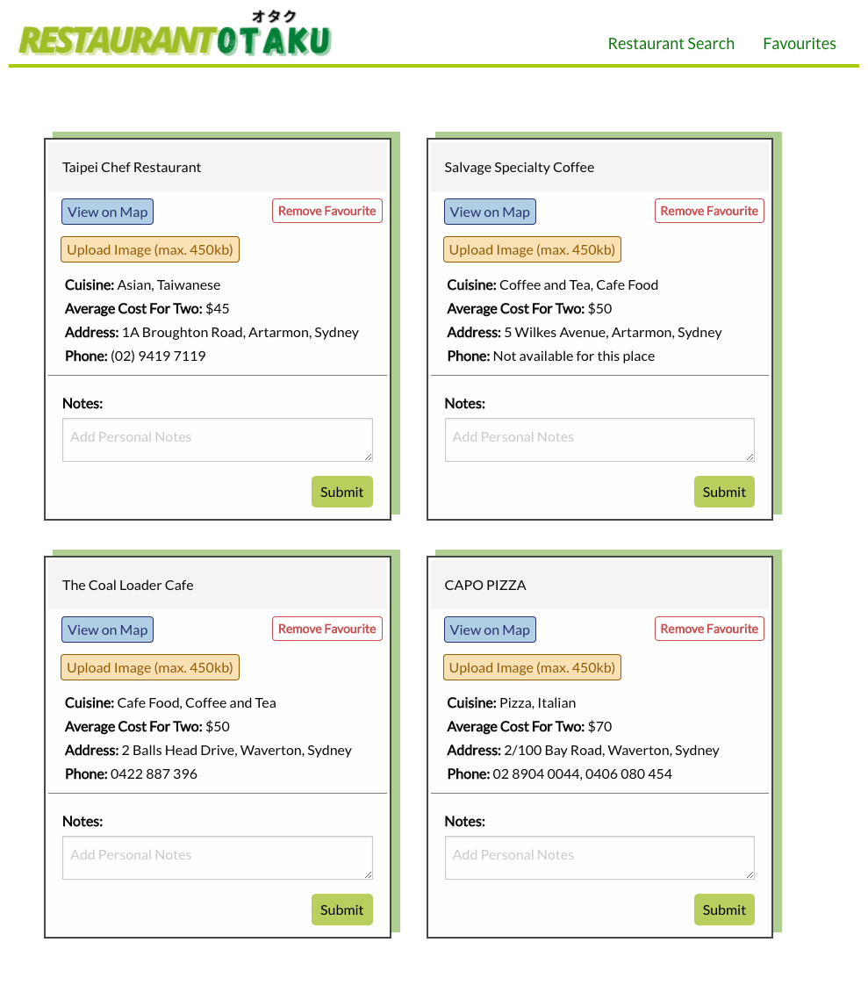
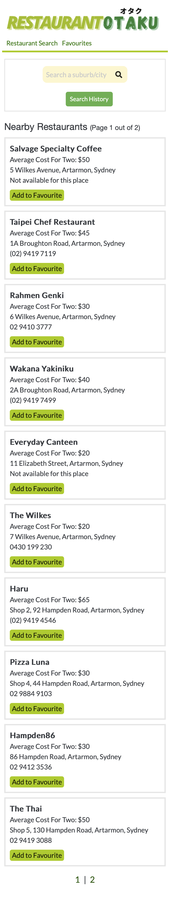
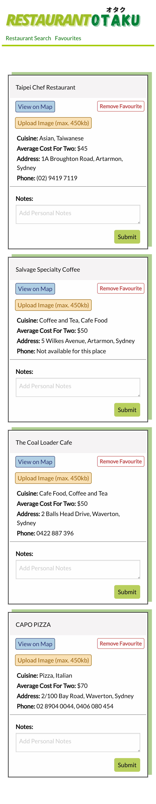

# Restaurant Otaku

## Project Description

This  project is a responsive and user-friendly web application that allows users to search for nearby restaurants in either an Australian suburb or city. It also includes a save function in which users can save a list of their favourite restaurants and add notes and images for personal reference. 

## Project Goals

This project aims to create a seamless, easily navigable and handy web application for either one-time or recurring users. The main objective of the project is to incorporate practical functions into the application so that frequent restaurant-goers have a convenient and personalised restaurant-searching and saving tool. User experience will be further enhanced by the employment of intuitive design.

## Authors

 1. Norbu Sherpa

 2. Tomomi Inoue

 3. Jessica Hong

 4. Mushtaq Safie
 

## Testing

Open the web application using the link https://norbu-s.github.io/Covid-Safe-Restaurant/

## Links to resources

### Functionality

1. [Zomato API](https://developers.zomato.com/api?lang=id)

2. [Google Maps Embed API](https://developers.google.com/maps/documentation/embed/get-started)

3. [moment.js](https://momentjs.com/)

4. [jQuery](https://jquery.com/)

5. [Mozilla Developer](https://developer.mozilla.org/en-US/)

6. [w3schools.com](https://www.w3schools.com/js/)

### Style

7. [Foundation](https://get.foundation/sites/docs/)

8. [Google Fonts](https://fonts.google.com/)

9. [Font Awesome](https://fontawesome.com/)

## Project Links

1. Project URL - https://norbu-s.github.io/Covid-Safe-Restaurant/

2. Github Repository - https://github.com/norbu-s/Covid-Safe-Restaurant

## Application Screenshots

### Desktop screens

### Tablet & Laptop screens 

### Mobile screens 

